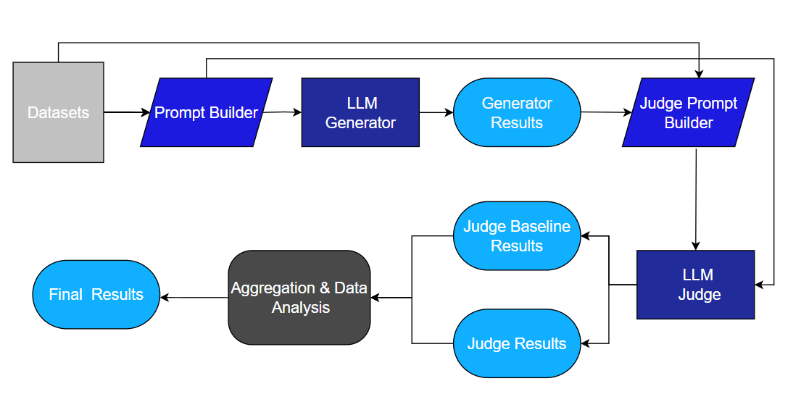

# LLM Evaluation Pipeline



This project implements a modular pipeline for evaluating LLMs using the LLM-as-a-Judge paradigm.

## Features
- Generator / Judge setup
- vLLM server-based inference
- Aggregation methods


## Usage Guidelines

This project is executed through the command line using the main script:

```bash
python test.py --promptroot <path_to_prompt> --model_name <model_alias> --results_dir <results_path> --role <generator|judge>

 ``` 
## Required Arguments

- `--promptroot`: Path to the predefined prompt set  
- `--model_name`: Model alias (the server must be running)  
- `--results_dir`: Directory where results will be stored  
- `--role`: Either `generator` or `judge`  

---

## Notes

- The server corresponding to `<model_alias>` must be running before execution.  
- The `<path_to_prompt>` should point to a predefined prompt set.  

---

## Recommended Setup

 

---

## CLI Commands

### `oneshot_all`

Runs the generator or judge on **all prompt files within a folder**, executing a one-shot evaluation for each file sequentially.

```bash
oneshot_all <path_to_folder>
```

This is useful for testing multiple datasets automatically using the same model and configuration, without manually triggering each run.

Notes:

- The <path_to_folder> should contain .jsonl prompt files.
- The command iterates over all files in the folder and runs them one by one.
- The model and role must be set beforehand (e.g., via start_server) and the same model-role pair is used for all files.
- Any change in role or model requires restarting or reconfiguring the server before running this command.

### `oneshot`

Runs the generator or judge on the dataset once.

```bash
oneshot <path_to_prompt>
```
for testing different dataset with the same model.

### `multirun`

```bash
multirun <path_to_prompt>
```
Runs the evaluation multiple times (default = 3) to assess model consistency. For testing multiply datasets the <path_to_prompt> can be follow multirun <path_to_prompt>
  #### Note that arguments like tempratur and random seed should ajust properly.


### ``stop_server``
``` bash
stop_server
```
 
Stops the current server/model, So another model can be tested. 


### `start_server`

``` bash
start_server <model_alias> <model_role>
```

 Starts a new servet for the model <model_alias>. 


### ``shutdown``

``` bash
shutdown
```
Terminates the aplication 

---

### Summary

This pipeline enables systematic evaluation of LLMs by separating generation and judging, allowing reproducible and scalable experimentation.
